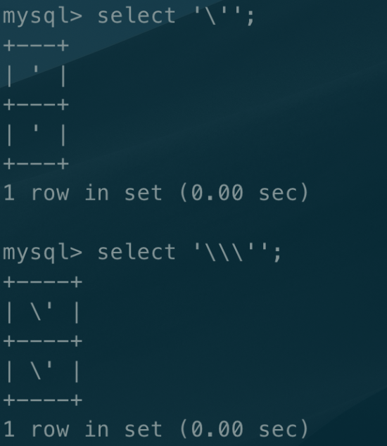

#### **skctf2019-easyweb**

------

- 爆破，收集信息得到目录
- 
  - 尝试add.php上传，看页面反应猜测只有前端只起迷惑作用。
- 文件包含，得到源码
  - 在`test.php`提示`put file parameter`猜测有文件包含漏洞
  - POST传入`file=php://filter/read=convert.base64-encode/resource=add.php`等等得到所有base64编码后的源码,base64解码得到源码
- 审计源码，查看sql过滤、上传过滤方式
  - sql过滤为：把`'`代替为空格，不好闭合。但是可以使第一个`‘`和第三个`'`来闭合注入使得sql语句为：即把`'`变成内容字符，而不是作为一个对于sql特殊意义的符号即可
    - `select * from skctf2019_admin where  password='\' and username=' or 1=1;#'`
    - 
  - upload过滤为：
    - 黑名单检测，去除后缀。双写即可绕过（还有很多别的绕过方式）
- 注入后登陆
- 上传得到shell
- 蚁剑连接，找到flag